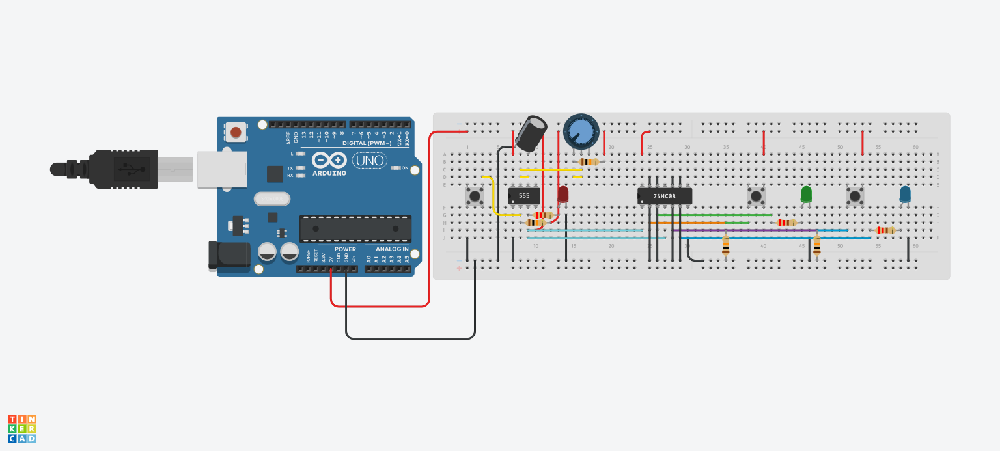
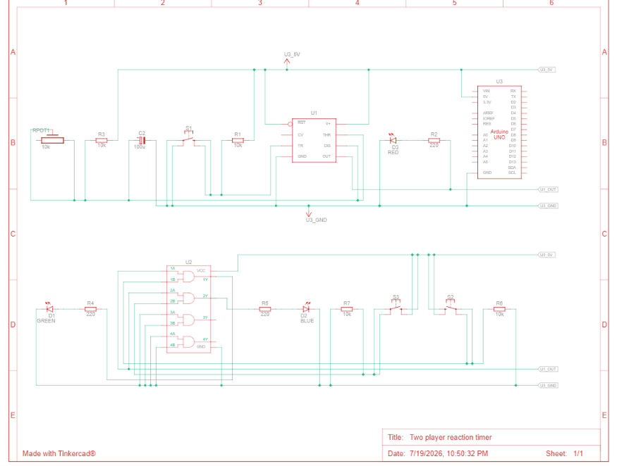
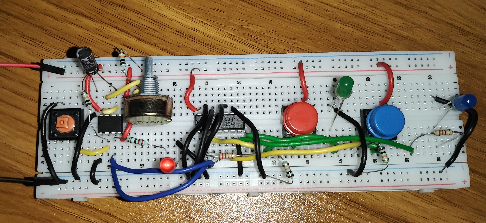
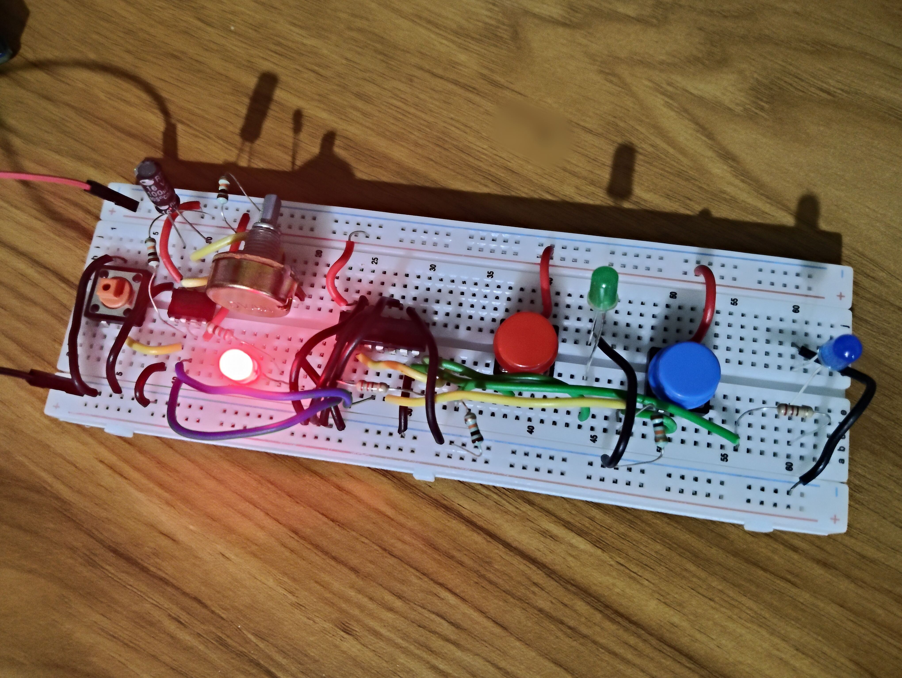
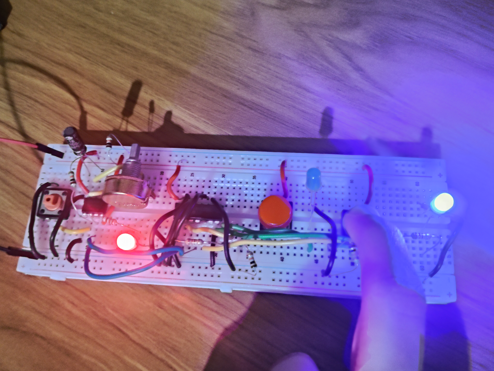

# Two-Player Reaction Timer Game

A digital electronics project that implements a **Two-Player Reaction Timer Game** using the **NE555 Timer IC** and **74HC08 (AND Gate IC)**. The system creates a reaction window after the Start button is pressed, allowing two players to compete by pressing their respective buttons. The first player to react during the active timing window lights their corresponding LED.

---

## Project Overview

The project demonstrates the practical application of digital logic and timer circuits without using any microcontroller. A NE555 timer generates a temporary READY signal, while the 74HC08 AND gate IC enables the player inputs only during the active timing period.

This project is ideal for learning:

- NE555 Timer (Monostable Mode)
- Digital Logic Gates
- Breadboard Circuit Design
- Timing Circuits
- Basic Digital Electronics

---

## Features

- Two-player reaction game
- Adjustable reaction window using a potentiometer
- READY indicator LED
- Individual LEDs for each player
- Built entirely using digital ICs
- No programming required
- Easy to build on a breadboard

---

## Components Used

| Component | Quantity |
|-----------|---------:|
| Arduino UNO (5V Power Supply) | 1 |
| NE555 Timer IC | 1 |
| 74HC08 Quad AND Gate IC | 1 |
| Push Buttons | 3 |
| LEDs | 3 |
| 220Ω Resistors | 3 |
| 10kΩ Resistors | 3 |
| B10K Potentiometer | 1 |
| 100µF Electrolytic Capacitor | 1 |
| Breadboard | 1 |
| Jumper Wires | As Required |

---

## Working Principle

1. The circuit is powered using a 5V supply.
2. Pressing the **START** button triggers the NE555 timer.
3. The NE555 generates a temporary **READY** signal.
4. During the READY period:
   - Player 1 may press their button.
   - Player 2 may press their button.
5. Each player's button is combined with the READY signal through an AND gate.
6. If a player presses their button while READY is HIGH, their corresponding LED lights.
7. Once the timer expires, the READY signal becomes LOW and both player inputs are disabled until the START button is pressed again.

---

# Images

## Circuit Diagram



---

## Schematic Diagram



---

## Wiring Diagram



---

## Game Starting



---

## Player 2 Winning



---

# Demonstration Video

**Video Link**

https://drive.google.com/drive/folders/1VOMpz7O0o0ZYug0iBTvPabzK7UJL-SyW

---

# Tinkercad Simulation

**Simulation Link**

https://www.tinkercad.com/things/73ledqcLO8s-two-player-reaction-timer?sharecode=cVs8LOjxJhKtwsDGBU4AK05-eNaOTQWmpT-WEmcioIQ

---

# Folder Structure

```
Two-Player-Reaction-Timer-Game/
│
├── Circuit_diagram.jpg
├── Schematic_Diagram.jpg
├── Wiring_Diagram.jpg
├── Game_Starting.jpg
├── Player_2_Winning.jpg
├── README.md
```

---

# Applications

- Digital Electronics Laboratory
- Educational Demonstration
- Logic Gate Learning
- Timing Circuit Demonstration
- Electronics Workshops
- Beginner Digital System Projects

---

# Future Improvements

- Adjustable reaction delay over a wider range
- Reaction time measurement using counters
- Winner memory latch
- False-start detection
- Seven-segment display for reaction timing
- Buzzer indication
- Score counter for multiple rounds

---

# Learning Outcomes

This project demonstrates:

- Practical use of the NE555 Timer IC
- Logic gate implementation using the 74HC08
- Breadboard prototyping
- Timing circuit design
- Digital input conditioning
- Basic game logic using hardware

---
